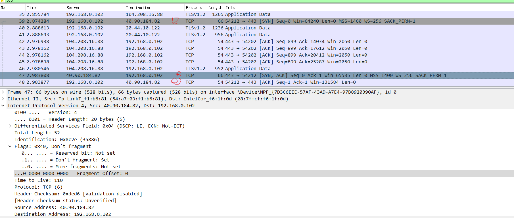
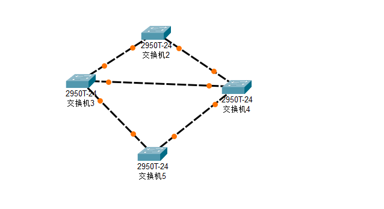
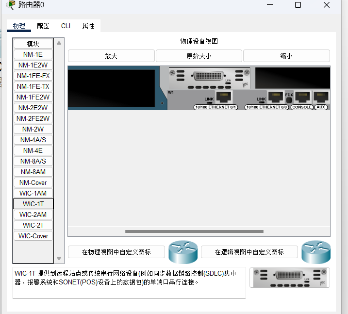
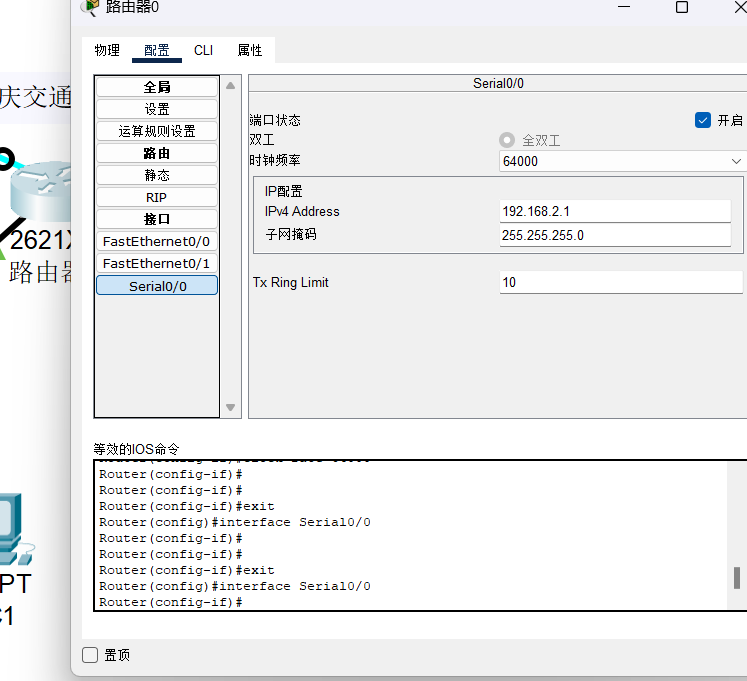
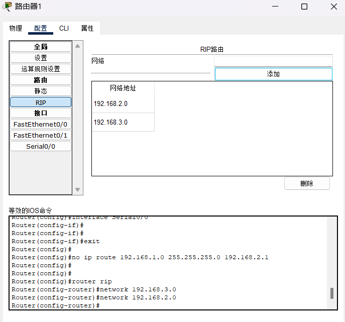

# Computer Network Experiment Report  

---  

## **验证性实验**  

### ***ipconfig***  

在电脑CMD中使用`ipconfig/all`后查看自己的网络配置：  

  
  
分析：  

* 主机名：本机的昵称  
* 主DNS后缀：默认为空，也就是本地解析。DNS后缀是用来解析主机名用的  
* ip路由一起用：判断该主机是否提供路由服务  
* 物理地址：以太网适配器的物理地址  
* IPV4地址：192.168.0.102，是本地正在局域网中所分配到的ip地址  
* 子网掩码：（转化为二进制）前24位为网络号，后八位为主机号，用来指明该ip所在的子网   * 获得租约的时间：此ip地址的开始使用时间  
* 租约过期的时间：此ip地址的到期时间  

> * *无线路由器都会存在一个租约，也就是规定时间内可以使用的IP地址，一般这个IP地址都是无线路由器的DHCP来分配*  

* 默认网关：本机的默认网关为：192.168.0.1默认网关的意思是一台主机如果找不到可用的网关，就把数据包发给默认指定的网关，由这个网关来处理数据包  
* DHCP:动态主机配置协议  
* DHCP服务器：DHCP服务器地址，提供DHCP服务的电脑的IP地址  

### ***ping***  

#### **实作一**  

测试到哔哩哔哩官网的连通性:  

  
分析：

* 字节=32，表示bilibili.com回复的数据包大小为32个字节
* 时间：为bilibili.com发出的包从发出到接收的时间
* TTL：包的生命周期，数据包没经过一个路由器TTL就会减一，当TTL为0仍未到达目的主机则该包将会被丢弃。图中显示TTL=55，即数据包还能经过55跳

#### **实作二**

使用 ping/? 命令了解该命令的各种选项并实际使用：  
  

* ``ping [-t]``:  
  
* ``ping [-n]``  
  
* ``ping [-l]``  
  
* ``ping [-i]``:给定生存时间（TTL）  
  

### ***tracert***

> TRACERT (Trace Route 的组合缩写)，也称为路由追踪，该命令行程序可用于跟踪 Internet 协议 （IP） 数据包传送到目标地址时经过的路径。  

使用 tracert www.bilibili.com 命令，查看反馈的信息，了解到某计算机如 www.baidu.com 中间经过了哪些节点（路由器）及其它状态。
> 可通过网站 [http://ip.cn] 查看这些节点位于何处，是哪个公司的，大致清楚本机到百度服务器之间的路径。

  
分析:

1. 第一列的数字1~10表示经过了10个路由节点
2. 中间的三列时间分别表示我们连接到每个路由节点的速度，返回速度和多次链接反馈的平均值
3. 最后一列的ip即表示每一个路由节点所对应的ip

> 查询得到的IP信息
> | ip | 所在地理位置 |
> | :--: |:--: |
> 192.168.0.1|内网IP 内网IP|
> 192.168.1.1|内网IP 内网IP|
> 10.238.128.1|内网IP 内网IP|
> 111.5.115.229|中国 河南省 周口市 移动|
> 111.5.7.65|中国 河南省 郑州市 移动|
> 111.5.7.134|中国 河南省 郑州市 移动|
> 111.6.222.242|中国 河南省 安阳市 移动|
> 111.6.167.134|中国 河南省 郑州市 移动|

* 在以上的实作中，如果你留意路径中的节点，你会发现无论是访问百度还是棋歌教学网，路径中的第一跳都是相同的，甚至你应该发现似乎前几个节点都是相同的，你认为是什么原因呢？

   > 我们发出的数据包都会首先经过当前网络所在的局域网的交换机，跳出当前局域网后再根据目的ip进行路由，因此前几跳几乎相同,都是当前局域网内网IP。

* 在追踪过程中，你可能会看到路径中某些节点显示为 * 号，这是发生了什么？

> 可能是某节点禁止你进行ping或者tracert操作，因此在你ping或者tracert时无数据返回，则显示*

### ***ARP***

> ARP（Address Resolution Protocol）即地址解析协议，是用于根据给定网络层地址即 IP 地址，查找并得到其对应的数据链路层地址即 MAC地址的协议。 ARP 协议定义在 1982 年的 RFC 826。

#### **实作一**  

运行``arp -a``命令查看当前的 arp 缓存， 请留意缓存了些什么。  
  
用来储存IP地址和MAC地址的缓冲区，其本质就是一个IP地址-->MAC地址的对应表，表中每一个条目分别记录了网络上其他主机的IP地址和对应的MAC地址

#### **实作二**

请使用 arp /? 命令了解该命令的各种选项：
  

#### **实作三**

一般而言，arp 缓存里常常会有网关的缓存，并且是动态类型的。
假设当前网关的 IP 地址是 192.168.0.1，MAC 地址是 5c-d9-98-f1-89-64，请使用 arp -s 192.168.0.1 5c-d9-98-f1-89-64 命令设置其为静态类型的
  
ARP添加失败，尝试使用管理员权限操作：
  
添加成功。  

### ***DHCP***  

> DHCP（Dynamic Host Configuration Protocol）即动态主机配置协议，是一个用于 IP 网络的网络协议，位于 OSI 模型的应用层，使用 UDP 协议工作，主要有两个用途：  
>
> 1. 用于内部网或网络服务供应商自动分配 IP 地址给用户
> 2. 用于内部网管理员对所有电脑作中央管理
简单的说，DHCP 可以让计算机自动获取/释放网络配置

#### **实作一**

一般地，我们自动获取的网络配置信息包括：IP 地址、子网掩码、网关 IP 以及 DNS 服务器 IP 等。使用``ipconfig/release``命令释放自动获取的网络配置，并用``ipconfig/renew``命令重新获取，了解 DHCP 工作过程和原理
  

该过程本计算机获得了一个新的IP。

> ✎ 问题：
在Windows系统下，如果由于某种原因计算机不能获取 DHCP 服务器的配置数据，那么Windows将会根据某种算法自动配置为 169.254.x.x 这样的 IP 地址。显然，这样的 IP 以及相关的配置信息是不能让我们真正接入 Internet 的，为什么？既然不能接入 Internet，那么Winodws系统采用这样的方案有什么意义？  
>> 这样的地址是为了告诉主机，IP地址里面没有多余的IP分给主机，或者 DHCP 中继代理失效。采用这种方案的意义是为了让不能够正常获取 IP 的主机之间进行临时的通信。

### ***netstat***

> 无论是使用 TCP 还是 UDP，任何一个网络服务都与特定的端口（Port Number）关联在一起。因此，每个端口都对应于某个通信协议/服务。
``netstat``（Network Statistics）是在内核中访问网络连接状态及其相关信息的命令行程序，可以显示路由表、实际的网络连接和网络接口设备的状态信息，以及与 IP、TCP、UDP 和 ICMP 协议相关的统计数据，一般用于检验本机各端口的网络服务运行状况。

#### **实作一**

Windows 系统将一些常用的端口与服务记录在 C:\WINDOWS\system32\drivers\etc\services 文件中，请查看该文件了解常用的端口号分配。

#### **实作二**

使用``netstat -an``命令，查看计算机当前的网络连接状况。  
  

### ***DNS***

> ``DNS``（Domain Name System）即域名系统，是互联网的一项服务。它作为将域名和 ``IP``地址相互映射的一个分布式数据库，能够使人更方便地访问互联网。``DNS``使用``TCP``和``UDP``的``53``号端口。

#### **实作一**

Windows 系统将一些固定的/静态的 DNS 信息记录在 ``C:\WINDOWS\system32\drivers\etc\hosts``文件中，如我们常用的``localhost``就对应``127.0.0.1``。请查看该文件看看有什么记录在该文件中。
> 文件夹为空？

#### **实作二**

解析过的 DNS 记录将会被缓存，以利于加快解析速度。请使用``ipconfig /displaydns``命令查看。我们也可以使用``ipconfig /flushdns``命令来清除所有的 DNS 缓存。
  

#### **实作三**

使用``nslookup qige.io``命令，将使用默认的``DNS``服务器查询该域名。  
  

### ***cache***
> ``cache``即缓存，是 IT 领域一个重要的技术。我们此处提到的``cache``主要是浏览器缓存。  
浏览器缓存是根据``HTTP``报文的缓存标识进行的，是性能优化中简单高效的一种优化方式了。一个优秀的缓存策略可以缩短网页请求资源的距离，减少延迟，并且由于缓存文件可以重复利用，还可以减少带宽，降低网络负荷。

#### **实作一**
打开 Chrome 或 Firefox 浏览器，访问``https://qige.io``，接下来敲``F12``键 或 ``Ctrl + Shift + I``组合键打开开发者工具，选择``Network``面板后刷新页面，你会在开发者工具底部看到加载该页面花费的时间。请进一步查看哪些文件被``cache``了，哪些没有。
  
如图所示：点击刷新界面只有qige.io被重新加载了。  
  

#### **实作二**

接下来仍在 Network 面板，选择 Disable cache 选项框，表明当前不使用 cache，页面数据全部来自于 Internet，刷新页面，再次在开发者工具底部查看加载该页面花费的时间。你可比对与有 cache 时的加载速度差异。  
  
选择禁用缓存后,对比上面使用内存的底部加载页面时间可以发现,使用内存加载页面花费1.01s,禁用内存花费2.17s,速度明显降低。  

---

## **Wireshark实验**

### **数据链路层**

#### **实作一**

使用 Wireshark 任意进行抓包，熟悉 Ethernet 帧的结构，如：目的 MAC、源 MAC、类型、字段等。  
  
> 问题：
你会发现 Wireshark 展现给我们的帧中没有校验字段，请了解一下原因。  
>
> * wireshark默认关闭校验,因此抓到包后会自动丢弃校验字段  

#### **实作二**

了解子网内/外通信时的 MAC 地址。

1. 然后``ping qige.io``（或者本子网外的主机都可以），同时用 Wireshark 抓这些包（可 icmp 过滤），记录一下发出帧的目的 MAC 地址以及返回帧的源 MAC 地址是多少？这个 MAC 地址是谁的？  
  
  
   如图，由于本机与qige.io不在同一子网，因此源mac地址应该为本机所在子网网关的mac地址。  
2. 再次``ping www.cqjtu.edu.cn``（或者本子网外的主机都可以），同时用 Wireshark 抓这些包（可 icmp 过滤），记录一下发出帧的目的 MAC 地址以及返回帧的源 MAC 地址又是多少？这个 MAC 地址又是谁的？  
  
  
源mac地址应该为本机所在子网网关的mac地址，目的mac地址为[www.cqjtu.edu.cn]（218.70.34.236）所在子网网关的mac地址。  

> 问题：
通过以上的实验，你会发现：
>
> 1. 访问本子网的计算机时，目的 MAC 就是该主机的
> 2. 访问非本子网的计算机时，目的 MAC 是网关的
> 请问原因是什么？
>
> * 访问非本子网的计算机时，首先是通过 mac 地址将信息传到指定网关处，出了网关后再通过 IP 地址进行查找；接收到非子网的计算机返回的数据也是先到网关，网关再根据目的 mac 将信息送到本机。

### ***网络层***

#### **实作一**

使用 Wireshark 任意进行抓包（可用 ip 过滤），熟悉 IP 包的结构，如：版本、头部长度、总长度、TTL、协议类型等字段。
  
版本：4；头部长度：20 bytes；总长度：40；TTL:128;协议类型：TCP

> 问题：
为提高效率，我们应该让 IP 的头部尽可能的精简。但在如此珍贵的 IP 头部你会发现既有头部长度字段，也有总长度字段。请问为什么？
>
> * 长度字段的存在能够让上层知道数据段的具体位置

#### **实作二**

IP 包的分段与重组。
根据规定，一个 IP 包最大可以有 64K 字节。但由于 Ethernet 帧的限制，当 IP 包的数据超过 1500 字节时就会被发送方的数据链路层分段，然后在接收方的网络层重组。
缺省的，ping 命令只会向对方发送 32 个字节的数据。我们可以使用``ping 202.202.240.16 -l 2000``命令指定要发送的数据长度。此时使用 Wireshark 抓包（用``ip.addr == 202.202.240.16``进行过滤），了解 IP 包如何进行分段，如：分段标志、偏移量以及每个包的大小等

如图：分了两页，偏移量：1480

> 问题：
分段与重组是一个耗费资源的操作，特别是当分段由传送路径上的节点即路由器来完成的时候，所以 IPv6 已经不允许分段了。那么 IPv6 中，如果路由器遇到了一个大数据包该怎么办？
>
> * 遇到一个大数据包时，会直接丢弃并返回发送失败信息

#### **实作三**
在``IP``包头中有一个``TTL``字段用来限定该包可以在Internet上传输多少跳（hops），一般该值设置为 64、128等。

在验证性实验部分我们使用了``tracert``命令进行路由追踪。其原理是主动设置 ``IP`` 包的 ``TTL`` 值，从 1 开始逐渐增加，直至到达最终目的主机。

请使用``tracert www.baidu.com``命令进行追踪，此时使用 Wireshark 抓包（用 icmp 过滤），分析每个发送包的 ``TTL`` 是如何进行改变的，从而理解路由追踪原理。

从图中可以看出tracert发送TTL依次递增的数据包，直到数据包可到达目的地址为止。

> 问题：
在 IPv4 中，TTL 虽然定义为生命期即 Time To Live，但现实中我们都以跳数/节点数进行设置。如果你收到一个包，其 TTL 的值为 50，那么可以推断这个包从源点到你之间有多少跳？
>
> * 因为TTL的原始值是离得最近的2的整次幂，为64。因此有14跳

### ***传输层***

#### **实作一**

1. 用 Wireshark 任意抓包（可用 tcp 过滤），熟悉 TCP 段的结构，如：源端口、目的端口、序列号、确认号、各种标志位等字段。

2. 用 Wireshark 任意抓包（可用 udp 过滤），熟悉 UDP 段的结构，如：源端口、目的端口、长度等。

#### **实作二**

分析 TCP 建立和释放连接

1. 打开浏览器访问 qige.io 网站，用 Wireshark 抓包（可用 tcp 过滤后再使用加上 Follow TCP Stream），不要立即停止 Wireshark 捕获，待页面显示完毕后再多等一段时间使得能够捕获释放连接的包。
2. 请在你捕获的包中找到三次握手建立连接的包，并说明为何它们是用于建立连接的，有什么特征。

用来建立TCP连接，每次握手有以下的特征：
第一次握手：syn=1,ack=0
第二次握手：syn=1,ack=1
第三次握手：syn=0,ack=1

### ***应用层***

#### **实作一**

1. 先使用 ``ipconfig /flushdns`` 命令清除缓存，再使用 ``nslookup qige.io`` 命令进行解析，同时用 Wireshark 任意抓包（可用 dns 过滤）。

2. 你应该可以看到当前计算机使用 UDP，向默认的 DNS 服务器的 53 号端口发出了查询请求，而 DNS 服务器的 53 号端口返回了结果。

3. 可了解一下 DNS 查询和应答的相关字段的含义：

#### **实作二**

1. 打开浏览器访问 qige.io 网站，用 Wireshark 抓包（可用http 过滤再加上 Follow TCP Stream），不要立即停止 Wireshark 捕获，待页面显示完毕后再多等一段时间以将释放连接的包捕获。

2. 请在你捕获的包中找到 HTTP 请求包，查看请求使用的什么命令，如：GET, POST。并仔细了解请求的头部有哪些字段及其意义。

* get请求：向WEB服务器请求获取文件资源

3. 请在你捕获的包中找到 HTTP 应答包，查看应答的代码是什么，如：200, 304, 404 等。并仔细了解应答的头部有哪些字段及其意义。

> * 200：请求已经处理成功
> * 304：客户端已经执行了GET，但文件未变化
> * 404：用户在Request-URI指定的域上不存在
> * 500: 服务器遇到未知情况，不能继续处理请求
> * 501: 服务器没有实现相关的请求功能
>
> 问题：
刷新一次 qige.io 网站的页面同时进行抓包，你会发现不少的 304 代码的应答，这是所请求的对象没有更改的意思，让浏览器使用本地缓存的内容即可。那么服务器为什么会回答 304 应答而不是常见的 200 应答？
>
> * 因为自从上次请求后，请求的网页未修改过。服务器会返回304告诉服务器可以使用本地缓存资源，节省带宽和开销

---

## **Cisco Packet Tracer 实验**

### **直接连接两台 PC 构建 LAN**

将两台 PC 直接连接构成一个网络。注意：直接连接需使用交叉线。

进行两台 PC 的基本网络配置，只需要配置 IP 地址即可，然后相互 ping 通即成功。

### **用交换机构建 LAN**

构建如下拓扑结构的局域网：  

各PC的基本网络配置如下表：  
| 机器名 | IP | 子网掩码 |
| --- | --- | --- |
| PC0 | 192.168.1.1 | 255.255.255.0 |
| PC1 | 192.168.1.2 | 255.255.255.0 |
| PC2 | 192.168.2.1 | 255.255.255.0 |
| PC3 | 192.168.2.2 | 255.255.255.0 |

> 问题：
>
> 1. PC0 能否 ping 通 PC1、PC2、PC3 ？  
  
> :可以ping通PC1,不能ping通PC2、PC3  
> 2. PC3 能否 ping 通 PC0、PC1、PC2 ？为什么？  
> :PC3能ping通PC2，但不能ping通PC0、PC1。  
> 3. 将 4 台 PC 的掩码都改为 255.255.0.0 ，它们相互能 ping 通吗？为什么？  
> :能。如果掩码为255.255.255.0，PC0、PC1和PC2、PC3不是同一局域网，他们之间不能互通。而掩码改为255.255.0.0，他们之间属于同一局域网下，可以互通。  
> 4. 使用二层交换机连接的网络需要配置网关吗？为什么？  
> :需要。  

### **交换机接口地址列表**

二层交换机是一种即插即用的多接口设备，它对于收到的帧有 3 种处理方式：广播、转发和丢弃（请弄清楚何时进行何种操作）。那么，要转发成功，则交换机中必须要有接口地址列表即 MAC 表，该表是交换机通过学习自动得到的！
仍然构建上图的拓扑结构，并配置各计算机的 IP 在同一个一个子网，使用工具栏中的放大镜点击某交换机如左边的 Switch3，选择 MAC Table，可以看到最初交换机的 MAC 表是空的，也即它不知道该怎样转发帧（那么它将如何处理？），用 PC0 访问（ping）PC1 后，再查看该交换机的 MAC 表，现在有相应的记录，请思考如何得来。随着网络通信的增加，各交换机都将生成自己完整的 MAC 表，此时交换机的交换速度就是最快的！  
  
  

### **生成树协议（Spanning Tree Protocol）**

交换机在目的地址未知或接收到广播帧时是要进行广播的。如果交换机之间存在回路/环路，那么就会产生广播循环风暴，从而严重影响网络性能。
而交换机中运行的 STP 协议能避免交换机之间发生广播循环风暴。  
只使用交换机，构建如下拓扑：  
  
这是初始时的状态。我们可以看到交换机之间有回路，这会造成广播帧循环传送即形成广播风暴，严重影响网络性能。  

随后，交换机将自动通过生成树协议（STP）对多余的线路进行自动阻塞（Blocking），以形成一棵以 Switch3 为根（具体哪个是根交换机有相关的策略）的具有唯一路径树即生成树！  

经过一段时间，随着 STP 协议成功构建了生成树后，Switch4 的两个接口当前物理上是连接的，但逻辑上是不通的，处于Blocking状态（桔色）如下图所示：  
  
在网络运行期间，假设某个时候 Switch3 与 Switch5 之间的物理连接出现问题（将 Switch3 与 Switch5 的连线剪掉），则该生成树将自动发生变化。Switch4 下方先前 Blocking 的那个接口现在活动了（绿色），但左方那个接口仍处于 Blocking 状态（桔色）。如下图所示：  
  
> 🗣 注意
> 交换机的 STP 协议即生成树协议始终自动保证交换机之间不会出现回路，从而形成广播风暴。

### **路由器配置初步**

我们模拟重庆交通大学和重庆大学两个学校的连接，构建如下拓扑：  
  
**说明一**
交通大学与重庆大学显然是两个不同的子网。在不同子网间通信需通过路由器。
路由器的每个接口下至少是一个子网，图中我们简单的规划了 3 个子网：

1. 左边路由器是交通大学的，其下使用交换机连接交通大学的网络，分配网络号 ``192.168.1.0/24``，该路由器接口也是交通大学网络的网关，分配 IP 为 ``192.168.1.1``
2. 右边路由器是重庆大学的，其下使用交换机连接重庆大学的网络，分配网络号 ``192.168.3.0/24``，该路由器接口也是重庆大学网络的网关，分配 IP 为 ``192.168.3.1``
3. 两个路由器之间使用广域网接口相连，也是一个子网，分配网络号 ``192.168.2.0/24``  
  
  

**说明二**
现实中，交通大学和重庆大学的连接是远程的。该连接要么通过路由器的光纤接口，要么通过广域网接口即所谓的 ``serial`` 口（如拓扑图所示）进行，一般不会通过双绞线连接（为什么？）。
下面我们以通过路由器的广域网口连接为例来进行相关配置。请注意：我们选用的路由器默认没有广域网模块（名称为 WIC-1T 等），需要关闭路由器后添加，然后再开机启动。  
  
> 添加如上图，先关闭电源，然后拖动WIC-1T模块到图中，之后打开电源即可  

**说明三**
在模拟的广域网连接中需注意 DCE 和 DTE 端（连线时线路上有提示，带一个时钟标志的是 DCE 端。有关 DCE 和 DTE 的概念请查阅相关资料。），在 DCE 端需配置时钟频率 64000  

**说明四**
路由器有多种命令行配置模式，每种模式对应不同的提示符及相应的权限。
请留意在正确的模式下输入配置相关的命令。

> User mode：用户模式
> Privileged mode：特权模式
> Global configuration mode：全局配置模式
> Interface mode：接口配置模式
> Subinterface mode：子接口配置模式

**说明五**
在现实中，对新的路由器，显然不能远程进行配置，我们必须在现场通过笔记本的串口与路由器的 console 接口连接并进行初次的配置（注意设置比特率为9600）后，才能通过网络远程进行配置。这也是上图左上画出笔记本连接的用意。  

**说明六**
在路由器的 CLI 界面中，可看到路由器刚启动成功后，因为无任何配置，将会提示是否进行对话配置（Would you like to enter the initial configuration dialog?），因其步骤繁多，请选择 NO

比如交通大学路由器的初步配置可以如下：
拓扑图中路由器各接口配置数据如下：

> | 接口名 | IP | 子网掩码 |
> | --- | --- | --- |
> 交通大学 Router2 以太网口 | 192.168.1.1 | 255.255.255.0 |
> 交通大学 Router2 广域网口 | 192.168.2.1 | 255.255.255.0 |
> 重庆大学 Router3 以太网口 | 192.168.3.1 | 255.255.255.0 |
> 重庆大学 Router3 广域网口 | 192.168.2.2 | 255.255.255.0 |

拓扑图中各 PC 配置数据如下：

> | 节点名 | IP | 子网掩码 | 网关 |
> | --- | --- | --- | --- |
> 交通大学 PC0 | 192.168.1.2 | 255.255.255.0 | 192.168.1.1 |
> 交通大学 PC1 | 192.168.1.3 | 255.255.255.0 | 192.168.1.1 |
> | 重庆大学 PC2 | 192.168.3.2 | 255.255.255.0 | 192.168.3.1 |
> | 重庆大学 PC3 | 192.168.3.3 | 255.255.255.0 | 192.168.3.1 |

  
  
  
  

交通大学路由器基本配置如下：
以太网口：

> Router>enable   // 从普通模式进入特权模式  
Router#configure terminal   // 进入全局配置模式  
Router(config)#interface f0/0   // 进入配置以太网口模式  
Router(config-if)#ip address 192.168.1.1 255.255.255.0   // 配置该接口的 IP  
Router(config-if)#no shutdown   // 激活接口  
Router(config-if)#^z   // 直接退到特权模式  
Router#  

  

广域网口：

> Router>en   // 从普通模式进入特权模式  
Router#conf t   // 进入全局配置模式  
Router(config)#int s0/0   // 进入配置广域网口模式  
Router(config-if)#ip address 192.168.2.1 255.255.255.0   //配置该接口的 IP  
Router(config-if)#clock rate 64000    // 其为 DCE 端，配置时钟频率  
Router(config-if)#no shutdown   // 激活接口  
Router(config-if)#^z   // 直接退到特权模式  
Router#  

  

重庆大学路由器基本配置如下：
以太网口：

> Router>en   // 从普通模式进入特权模式  
Router#conf t   // 进入全局配置模式  
Router(config)#int f0/0   // 进入配置以太网口模式  
Router(config-if)#ip address 192.168.3.1 255.255.255.0   // 配置该接口的 IP  
Router(config-if)#no shutdown   // 激活接口  
Router(config-if)#^z   // 直接退到特权模式  
Router#  

  

广域网口：

> Router>en   // 从普通模式进入特权模式  
Router#conf t   // 进入全局配置模式  
Router(config)#int s0/0   // 进入配置广域网口模式  
Router(config-if)#ip address 192.168.2.2 255.255.255.0   //配置该接口的 IP  
Router(config-if)#no shutdown   // 激活接口  
Router(config-if)#^z   // 直接退到特权模式  
Router#  

  

至此，路由器基本的配置完成。请按照上面 PC 配置表继续配置各个 PC 。

**静态路由**
静态路由是非自适应性路由协议，是由网络管理人员手动配置的，不能够根据网络拓扑的变化而改变。 因此，静态路由简单高效，适用于结构非常简单的网络。

在当前这个简单的拓扑结构中我们可以使用静态路由，即直接告诉路由器到某网络该怎么走即可。

在前述路由器基本配置成功的情况下使用以下命令进行静态路由协议的配置：

交通大学路由器静态路由配置：

> Router>en   // 从普通模式进入特权模式  
Router#conf t   // 进入全局配置模式  
Router(config)#ip route 192.168.3.0 255.255.255.0 192.168.2.2   // 告诉交通大学路由器到 192.168.3.0 这个网络的下一跳是 192.168.2.2  
Router(config)#exit   //退到特权模式  
Router#show ip route    //查看路由表  

  

重庆大学路由器静态路由配置：

> Router>en   // 从普通模式进入特权模式  
Router#conf t   // 进入全局配置模式  
Router(config)#ip route 192.168.1.0 255.255.255.0 192.168.2.1   // 告诉重庆大学路由器到 192.168.1.0 这个网络的下一跳是 192.168.2.1  
Router(config)#exit   //退到特权模式  
Router#show ip route    //查看路由表  

查看路由表你可看到标记为 S 的一条路由，S 表示 Static 。  
  
至此，这些 PC 能全部相互 ping 通！  

> 🗣 注意
>
> 我们的拓扑只模拟了 3 个网络。在现实中，路由器连接的网络数量非常多，我们还需要配置一条缺省路由，否则其它网络皆不能到达！当然，我们的拓扑可以不考虑。
>
> Router(config)#ip route 0.0.0.0 0.0.0.0 *.*.*.* // 缺省全部转发给 *.*.*.* 这个IP

**动态路由 RIP**
动态路由协议采用自适应路由算法，能够根据网络拓扑的变化而重新计算机最佳路由。

RIP 的全称是 Routing Information Protocol，是距离矢量路由的代表（目前虽然淘汰，但可作为我们学习的对象）。使用 RIP 协议只需要告诉路由器直接相连有哪些网络即可，然后 RIP 根据算法自动构建出路由表。

因为我们模拟的网络非常简单，因此不能同时使用静态和动态路由，否则看不出效果，所以我们需要把刚才配置的静态路由先清除掉。

清除静态路由配置：

1. 直接关闭路由器电源。相当于没有保存任何配置，然后各接口再按照前面基本配置所述重新配置 IP 等参数（推荐此方法，可以再熟悉一下接口的配置命令）；
2. 使用 no 命令清除静态路由。在全局配置模式下，交通大学路由器使用：no ip route 192.168.3.0 255.255.255.0 192.168.2.2，重庆大学路由器使用：no ip route 192.168.1.0 255.255.255.0 192.168.2.1 。相当于使用 no 命令把刚才配置的静态路由命令给取消。

交通大学路由器 RIP 路由配置：

> Router>en   // 从普通模式进入特权模式  
Router#conf t   // 进入全局配置模式  
Router(config)#router rip   // 启用 RIP 路由协议，注意是 router 命令  
Router(config-router)#network 192.168.1.0   // 网络 192.168.1.0 与我直连  
Router(config-router)#network 192.168.2.0   // 网络 192.168.2.0 与我直连  
Router(config-router)#^z   //直接退到特权模式  
Router#show ip route    //查看路由表  

重庆大学路由器 RIP 路由配置：

> Router>en   // 从普通模式进入特权模式  
Router#conf t   // 进入全局配置模式  
Router(config)#router rip   // 启用RIP路由协议，注意是 router 命令  
Router(config-router)#network 192.168.3.0   // 网络 192.168.3.0 与我直连  
Router(config-router)#network 192.168.2.0   // 网络 192.168.2.0 与我直连  
Router(config-router)#^z   //直接退到特权模式  
Router#show ip route    //查看路由表  

  

查看路由表你可看到标记为 R 的一条路由，R 表示 RIP 。  
  
至此，这些 PC 也能全部相互 ping 通！  

**动态路由 OSPF**
OSPF（Open Shortest Path First 开放式最短路径优先）是一个内部网关协议（Interior Gateway Protocol，简称 IGP）， 用于在单一自治系统（Autonomous System，AS）内决策路由。OSPF 性能优于 RIP，是当前域内路由广泛使用的路由协议。

同样的，我们需要把刚才配置的 RIP 路由先清除掉。

清除 RIP 路由配置：

1. 直接关闭路由器电源。相当于没有保存任何配置，然后各接口再按照前面基本配置所述重新配置 IP 等参数
2. 使用 no 命令清除 RIP 路由。在全局配置模式下，各路由器都使用：no router rip 命令进行清除

交通大学路由器 OSPF 路由配置：

> Router>en   // 从普通模式进入特权模式  
Router#conf t   // 进入全局配置模式  
Router(config)#router ospf 1   // 启用 OSPF 路由协议，进程号为1（可暂不理会进程号概念）  
Router(config-router)#network 192.168.1.0 0.0.0.255 area 0   // 自治域0中的属于 192.168.1.0/24 网络的所有主机（反向掩码）参与 OSPF  
Router(config-router)#network 192.168.2.0 0.0.0.255 area 0   // 自治域0中的属于 192.168.2.0/24 网络的所有主机（反向掩码）参与 OSPF  
Router(config-router)#^z   //直接退到特权模式  
Router#show ip route    //查看路由表  

重庆大学路由器 OSPF 路由配置：

> Router>en   // 从普通模式进入特权模式  
Router#conf t   // 进入全局配置模式  
Router(config)#router ospf 1   // 启用 OSPF 路由协议，进程号为1  
Router(config-router)#network 192.168.3.0 0.0.0.255 area 0   // 自治域0中的属于 192.168.3.0/24 网络的所有主机（反向掩码）参与 OSPF  
Router(config-router)#network 192.168.2.0 0.0.0.255 area 0   // 自治域0中的属于 192.168.2.0/24 网络的所有主机（反向掩码）参与 OSPF  
Router(config-router)#^z   //直接退到特权模式  
Router#show ip route    //查看路由表  

查看路由表你可看到标记为 O 的一条路由，O 表示 OSPF 。

至此，这些 PC 能全部相互 ping 通！

**基于端口的网络地址翻译 PAT**
网络地址转换（NAT，Network Address Translation）被各个 Internet 服务商即 ISP 广泛应用于它们的网络中，也包括 WiFi 网络。 原因很简单，NAT 不仅完美地解决了 lP 地址不足的问题，而且还能够有效地避免来自网络外部的攻击，隐藏并保护网络内部的计算机。

NAT 的实现方式一般有三种：

* 静态转换： Static NAT
* 动态转换： Dynamic NAT
* 端口多路复用： OverLoad

端口多路复用使用最多也最灵活。OverLoad 是指不仅改变发向 Internet 数据包的源 IP 地址，同时还改变其源端口，即进行了端口地址转换（PAT，Port Address Translation）。

采用端口多路复用方式，内部网络的所有主机均可共享一个合法外部 IP 地址实现对 Internet 的访问，从而可以最大限度地节约IP地址资源。 同时，又可隐藏网络内部的所有主机，有效避免来自 Internet 的攻击。因此，目前网络中应用最多的就是端口多路复用方式。

我们仍然使用重庆交通大学和重庆大学两个学校的拓扑进行 PAT 实验。我们需要保证两个学校的路由已经配置成功，无论使用静态路由还是动态路由，以下我们给出完整的配置过程：设定这两个学校的路由器使用 OSPF 协议，模拟交通大学使用内部 IP 地址``（192.168.1.0/24）``，模拟重庆大学使用外部 IP 地址``（8.8.8.0/24）``，两个路由器之间使用外部 IP 地址``（202.202.240.0/24）``，在交通大学的出口位置即广域网口实施 PAT。

拓扑图中各 PC 配置数据如下：

> |节点名|IP|子网掩码|网关|
> |---|---|---|---|
> 交通大学 PC0|192.168.1.2|255.255.255.0|192.168.1.1
> 交通大学 PC1|192.168.1.3|255.255.255.0|192.168.1.1
> 重庆大学 PC2|8.8.8.2|255.255.255.0|8.8.8.1
> 重庆大学 PC3|8.8.8.3|255.255.255.0|8.8.8.1

拓扑图中路由器各接口配置数据如下：

> 接口名|IP|子网掩码
> ---|---|---
> 交通大学 Router2 以太网口|192.168.1.1|255.255.255.0
> 交通大学 Router2 广域网口|202.202.240.1|255.255.255.0
> 重庆大学 Router3 以太网口|8.8.8.1|255.255.255.0
> 重庆大学 Router3 广域网口|202.202.240.2|255.255.255.0

交通大学路由器接口配置如下：

以太网口：

> Router>en   // 从普通模式进入特权模式  
Router#conf t   // 进入全局配置模式  
Router(config)#int f0/0   // 进入配置以太网口模式  
Router(config-if)#ip address 192.168.1.1 255.255.255.0   // 配置 IP  
Router(config-if)#no shutdown   // 激活接口  

广域网口：

> Router>en   // 从普通模式进入特权模式  
Router#conf t   // 进入全局配置模式  
Router(config)#int s0/0   // 进入配置广域网口模式  
Router(config-if)#ip address 202.202.240.1 255.255.255.0   //配置 IP  
Router(config-if)#clock rate 64000    // 其为 DCE 端，配置时钟频率  
Router(config-if)#no shutdown   // 激活接口  

重庆大学路由器接口配置如下：

以太网口：

> Router>en   // 从普通模式进入特权模式  
Router#conf t   // 进入全局配置模式  
Router(config)#int f0/0   // 进入配置以太网口模式  
Router(config-if)#ip address 8.8.8.1 255.255.255.0   // 配置 IP  
Router(config-if)#no shutdown   // 激活接口  

广域网口：

> Router>en   // 从普通模式进入特权模式  
Router#conf t   // 进入全局配置模式  
Router(config)#int s0/0   // 进入配置广域网口模式  
Router(config-if)#ip address 202.202.240.2 255.255.255.0   // 配置 IP  
Router(config-if)#no shutdown   // 激活接口  

交通大学路由器 OSPF 路由配置：

> Router>en   // 从普通模式进入特权模式  
Router#conf t   // 进入全局配置模式  
Router(config)#router ospf 1   // 启用 OSPF 路由协议，进程号为1（可暂不理会进程号概念）  
Router(config-router)#network 192.168.1.0 0.0.0.255 area 0   // 自治域0中的属于192.168.1.0/24网络的所有主机（反向掩码）参与 OSPF  
Router(config-router)#network 202.202.240.0 0.0.0.255 area 0   // 自治域0中的属于202.202.240.0/24网络的所有主机（反向掩码）参与 OSPF  

重庆大学路由器 OSPF 路由配置：

> Router>en   // 从普通模式进入特权模式  
Router#conf t   // 进入全局配置模式  
Router(config)#router ospf 1   // 启用 OSPF 路由协议，进程号为1  
Router(config-router)#network 202.202.240.0 0.0.0.255 area 0   // 自治域0中的属于202.202.240.0/24网络的所有主机（反向掩码）参与 OSPF  
Router(config-router)#network 8.8.8.0 0.0.0.255 area 0   // 自治域0中的属于8.8.8.0/24网络的所有主机（反向掩码）参与 OSPF  

此时，这些 PC 能全部相互 ping 通！如在交通大学内部使用 PC0（192.168.1.2）来 ping 重庆大学的PC2（8.8.8.2）应该成功。

下面我们将重庆大学的路由器看着 Internet 中的骨干路由器，那么这些路由器将不会转发内部/私有 IP 地址的包（直接丢弃）。我们通过在重庆大学路由器上实施访问控制 ACL ，即丢弃来自交通大学（私有 IP 地址）的包来模拟这个丢包的过程。

重庆大学路由器丢包的配置：

> Router>en   // 从普通模式进入特权模式  
Router#conf t   // 进入全局配置模式  
Router(config)#access-list 1 deny 192.168.1.0 0.0.0.255  // 创建 ACL 1，丢弃/不转发来自 192.168.1.0/24 网络的所有包  
Router(config)#access-list 1 permit any  // 添加 ACL 1 的规则，转发其它所有网络的包  
Router(config)#int s0/0   // 配置广域网口  
Router(config-if)#ip access-group 1 in  // 在广域网口上对进来的包实施 ACL 1 中的规则，实际就是广域网口如果收到来自 192.168.1.0/24 IP的包即丢弃  

此时，再使用交通大学内部的 PC0（192.168.1.2）来 ping 重庆大学的 PC2（8.8.8.2）就不成功了，会显示目的主机不可到达（Destination host unreachable）信息。

下面，我们就开始实施 PAT。即：我们将会在交通大学路由器的出口上将内部/私有 IP 地址转换为外部/公开 IP，从而包的源 IP 发生了改变，就不会被重庆大学路由器丢弃，因此网络连通。

交通大学路由器 PAT 配置：

> Router>en   // 从普通模式进入特权模式  
Router#conf t   // 进入全局配置模式  
Router(config)#access-list 1 permit 192.168.1.0 0.0.0.255  // 创建 ACL 1，允许来自 192.168.1.0/24 网络的所有包  
Router(config)#ip nat inside source list 1 interface s0/0 overload  // 来自于 ACL 中的 IP 将在广域网口实施 PAT  
Router(config)#int f0/0   // 配置以太网口  
Router(config-if)#ip nat inside   // 配置以太网口为 PAT 的内部  
Router(config)#int s0/0   // 配置广域网口  
Router(config-if)#ip nat outside   // 配置广域网口为 PAT 的外部  

现在，再次使用交通大学内部的 PC0（192.168.1.2）来 ping 重庆大学的PC2（8.8.8.2）则OK。  
  
如图，可以ping成功。  

**虚拟局域网管理 VTP**
前一个实验我们在交换机上进行了 VLAN 的规划和划分。但在实际应用中，我们绝不允许在这些支持VLAN的交换机上进行随意的 VLAN 划分，如此将造成管理混乱！VLAN的划分必须得到统一的规划和管理，这就需要 VTP 协议。

VTP（VLAN Trunk Protocol）即 VLAN 中继协议。VTP 通过 ISL 帧或 Cisco 私有 DTP 帧（可查阅相关资料了解）保持 VLAN 配置统一性，也被称为虚拟局域网干道协议，它是思科私有协议。 VTP 统一管理、增加、删除、调整VLAN，自动地将信息向网络中其它的交换机广播。

此外，VTP 减小了那些可能导致安全问题的配置，只要在 VTP Server 做相应设置，VTP Client 会自动学习 VTP Server 上的 VLAN 信息。

为演示 VTP，重新构建如下拓扑结构：

>🗣 注意：
>
> 作为干线，两个 2960 交换机和核心的 3560 交换机应该使用 Gbit 口相连。这虽然不是必须，但现实中这样连接性能最好。

目前该网络都属于 ``VLAN 1``，也即这些 PC 是可以相互通信的。前面说过，无论对于性能、管理还是安全等而言，现实中我们必须进行 VLAN 划分。

现在我们的要求是：新建两个 ``VLAN``，然后让 ``PC0`` 和 ``PC1`` 属于 ``VLAN 2``，``PC1`` 和 ``PC3`` 属于 ``VLAN 3``。

我们将在核心交换机 3560上进行如下工作：

1. 设置为 server 模式，VTP 域为 cqjtu  
2. 新建 VLAN 2，网络号 192.168.1.0/24，网关 192.168.1.1  
3. 新建 VLAN 3，网络号 192.168.2.0/24，网关 192.168.2.1  

3560 VTP Server 配置：

> Switch>en
Switch#conf t  
Switch(config)#hostname 3560    // 更改交换机名称（可选）  
3560(config)#vtp domain cqjtu   // 设置 VTP 域名称为 cqjtu  
3560(config)#vtp mode server    // 设置其为 VTP 服务器模式  
3560(config)#vlan 2             // 新建VLAN 2  
3560(config-vlan)#name computer // 设置 VLAN 2 的别名（可选）  
3560(config-vlan)#exit  
3560(config)#vlan 3             // 再建 VLAN 3  
3560(config-vlan)#name communication    //设置 VLAN 2 的别名（可选）  
3560(config-vlan)#exit  
3560(config)#int vlan 2    // 配置接口 VLAN 2，它将是该子网（左边）的网关  
3560(config-if)#ip address 192.168.1.1 255.255.255.0  
3560(config-if)#exit  
3560(config)#int vlan 3    // 配置接口 VLAN 3，它将是该子网（右边）的网关  
3560(config-if)#ip address 192.168.2.1 255.255.255.0  

我们将在左边交换机 2960A 上进行如下工作：

1. 加入名为 cqjtu 的 VTP 域
2. 配置与核心交换机 3560 连接的千兆接口 g0/1 为 trunk 模式
3. 将接口 f0/1 划分到 VLAN 2 中
4. 将接口 f0/2 划分到 VLAN 3 中

2960A（左边） VTP Client 配置：

> Switch>en  
Switch#conf t  
Switch(config)#hostname 2960A    // 更改交换机名称（可选）  
2960A(config)#vtp domain cqjtu   // 加入名为 cqjtu 的 VTP 域  
2960A(config)#vtp mode client    // 设置模式为 VTP 客户  
2960A(config)#int g0/1    // 配置与核心交换机 3560 连接的 g0/1 千兆接口  
2960A(config-if)#switchport mode trunk    // 设置该接口为中继（trunk）模式  
2960A(config-if)#switchport trunk allowed vlan all  // 允许为所有的 VLAN 中继  
2960A(config-if)#exit  
2960A(config)#int f0/1    // 配置接口 1  
2960A(config-if)#switchport mode access    // 设置该接口为正常访问模式  
2960A(config-if)#switchport access vlan 2  // 将接口划分到 VLAN 2  
2960A(config-if)#exit  
2960A(config)#int f0/2    // 配置接口 2  
2960A(config-if)#switchport mode access    // 设置该接口为正常访问模式  
2960A(config-if)#switchport access vlan 3  // 将接口划分到 VLAN 3  

我们将在右边交换机 2960B 上进行同样的工作：

1. 加入名为 cqjtu VTP 域
2. 配置与核心交换机 3560 连接的千兆接口 g0/1 为 trunk 模式
3. 将接口 f0/1 划分到 VLAN 2 中
4. 将接口 f0/2 划分到 VLAN 3 中

2960B（右边） VTP Client 配置：

> Switch>en  
Switch#conf t  
Switch(config)#hostname 2960B    // 更改交换机名称（可选）  
2960B(config)#vtp domain cqjtu   // 加入名为 cqjtu 的 VTP 域  
2960B(config)#vtp mode client    // 设置模式为 VTP 客户  
2960B(config)#int g0/1    // 配置与核心交换机 3560 连接的 g0/1 千兆接口  
2960B(config-if)#switchport mode trunk    // 设置该接口为中继（trunk）模式  
2960B(config-if)#switchport trunk allowed vlan all  // 允许为所有的 VLAN 中继  
2960B(config-if)#exit  
2960B(config)#int f0/1    // 配置接口 1  
2960B(config-if)#switchport mode access    // 设置该接口为正常访问模式  
2960B(config-if)#switchport access vlan 2  // 将接口划分到 VLAN 2  
2960B(config-if)#exit  
2960B(config)#int f0/2    // 配置接口 2  
2960B(config-if)#switchport mode access    // 设置该接口为正常访问模式  
2960B(config-if)#switchport access vlan 3  // 将接口划分到 VLAN 3  

至此，各交换机配置完毕。

> 📬 秘籍
> 此时在 3 个交换机的特权模式下，都可使用show vtp status命令查看 VTP 状态，使用show vlan命令查看 VLAN 状态:  
>   

各 PC 连接的交换机和接口以及网络配置如下：

> 机器名|连接的交换机和接口|所属VLAN|IP|子网掩码|网关
> ---|---|---|---|---|---
> PC0|2960A-F0/1|VLAN 2|192.168.1.2|255.255.255.0|192.168.1.1
> PC1|2960A-F0/2|VLAN 3|192.168.2.2|255.255.255.0|192.168.2.1
> PC2|2960B-F0/1|VLAN 2|192.168.1.3|255.255.255.0|192.168.1.1
> PC3|2960B-F0/2|VLAN 3|192.168.2.3|255.255.255.0|192.168.2.1

至此，VTP 配置完成。同 VLAN 可以 ping 通，而不同 VLAN 不行（即使在同一交换机下，如从 PC0 到 PC1），且能够方便的统一规划和管理。

> ✎ 试一试
>
> 使用 PC0（192.168.1.2） ping PC1（192.168.2.2） 的结果如何？使用 PC0 ping PC2 的结果如何？想想为什么？  
>   
> ping通的是同一VLAN下的，不同VLAN下的不能ping通

**DHCP、DNS及Web服务器简单配置**
动态主机配置 DHCP、域名解析 DNS 以及 Web 服务在日常应用中作用巨大，我们构建如下简单的拓扑来进行练习。  
  

> ✎ 试一试
>
> 先查看各 PC，看看是否获得网络配置
> 因为我们在 DNS 服务器中把谷歌和百度的 IP 都设为了 19.89.6.4，即 Server-PT，所 以，如果打开 PC0 的浏览器，输入 www.google.com 或者 www.baidu.com，我们都应
> 该看到默认的 Server-PT 这个 Web 服务器的主页（你也可进行编辑）  
>
> * 接下来查看PC4是否获取到IP：  
>   
> * 最后打开浏览器查看我们设置的网址是否展示默认的界面：  
>   

**WLAN初步配置**
WLAN 即 WiFi 当前也是广泛的应用在各种场景。  

我们通过构建如下拓扑的一个家庭 WLAN 来练习一下其相关的配置：  
  

> 📬 秘籍
>
> 笔记本及台式机默认只有有线网卡，请先关机，在关机状态下删除有线网卡，添加无线网卡，然后再开机。  
>   

然后查看计算机是否获取到IP:  
  

然后用台式机ping另一台台式机和笔记本：  
  
  
都能够ping通。  

一般地，我们需要配置无线路由器的基本网络配置（IP、掩码、网关、DNS 等，现实中多为自动获取），然后再配置无线路由器的无线访问部分如连接密码及加密类型等，并开启 DHCP 功能等。  
配置无线路由器的无线访问部分的加密类型和密码并尝试连接：  
  
能够根据密码连接网络。  

开启 DHCP 功能
  
开启成功。  
至此家庭WLAN构建完成。  

## **实验总结**

这次三个部分的实验让我对计算机网络的了解加深了许多，并且了解学习了wireshark和Cisco Packet Tracer这两个软件的使用，属实是受益良多，同时让我感慨计算机网络方面的东西挺好玩的，这过程是充满乐趣的。
